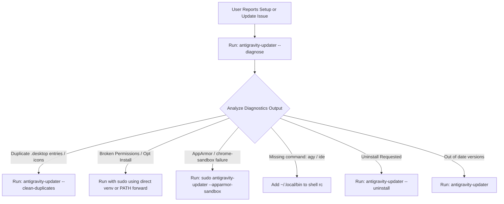

# AI Assistant & Agent Instruction Guide (`AGENTS.md`)

This document provides system knowledge, decision trees, diagnostic workflows, and automated recipes for AI coding assistants (e.g. Antigravity Agent, Claude Code, Cursor, Copilot, Gemini, Aider) helping users install, configure, diagnose, and troubleshoot `missing-ag-updater` and the **Google Antigravity** developer suite.

---

## 🧭 System Architecture & Component Overview

The Google Antigravity developer suite consists of three distinct components:

| Component | Description | Default User Path (`--user`) | Default System Path (`--system`) | Executable Name |
| :--- | :--- | :--- | :--- | :--- |
| **Antigravity IDE** | VS Code-based AI editor | `~/opt/Antigravity-IDE` | `/opt/antigravity-ide` | `antigravity-ide` |
| **Antigravity Hub** | Standalone AI Agent desktop application | `~/opt/Antigravity-x64` | `/opt/antigravity` | `antigravity` |
| **Antigravity CLI** | Fast command-line interface | `~/.local/bin/agy` | `/usr/local/bin/agy` | `agy` |

---

## 🛠️ Step-by-Step Diagnostic & Action Protocol

When assisting a user with setup, unexpected duplicate icons, hanging processes, or version issues, execute the following protocol in order:



### Step 1: Diagnose System State
Always start by inspecting the live environment:
```bash
antigravity-updater --diagnose
```
This inspects all PATH executables, candidate filesystem directories, registered `.desktop` files, active PIDs, and AppArmor status.

---

## 📋 Common Troubleshooting Recipes for AI Agents

### Recipe 1: Fixing Duplicate Icons & Conflicting Scopes
**Symptom:** User has multiple icons for Antigravity IDE or Hub in their GNOME / Pop!_OS application launcher.  
**Cause:** The user has both system-wide (`/usr/share/applications/*.desktop`) and user-level (`~/.local/share/applications/*.desktop`) desktop files.  
**Agent Action:**
```bash
# Clean user duplicates and point launcher to system installation:
antigravity-updater --clean-duplicates --system

# If user also wants to delete stale user-level ~/opt directories:
antigravity-updater --clean-duplicates --system --remove-user-dirs
```

---

### Recipe 2: Running System (`/opt`) Updates with `sudo`
**Symptom:** `sudo uv run ...` or `sudo antigravity-updater ...` fails with `sudo: command not found`.  
**Cause:** `/etc/sudoers` has `secure_path` enabled, resetting `$PATH` and stripping `~/.local/bin` and virtualenvs.  
**Agent Action:** Use one of these two verified commands:

1. **When running directly from a cloned repo / local virtualenv:**
   ```bash
   sudo ./.venv/bin/antigravity-updater --system
   ```

2. **When `antigravity-updater` is installed via `uv tool` or `pipx`:**
   ```bash
   sudo env "PATH=$PATH" antigravity-updater --system
   ```

---

### Recipe 3: Ubuntu 24.04+ & Pop!_OS AppArmor / Sandbox Fix
**Symptom:** Antigravity IDE crashes on startup with `FATAL:zygote_host_impl_linux.cc` or fails to launch on Ubuntu 24.04 / Pop!_OS.  
**Cause:** AppArmor unprivileged user namespaces (`apparmor_restrict_unprivileged_userns`) block Electron namespace sandboxes.  
**Agent Action:**
Configure the SUID sandbox helper binary with `root:root 4755`:
```bash
# Via updater:
sudo env "PATH=$PATH" antigravity-updater --apparmor-sandbox

# Or direct venv:
sudo ./.venv/bin/antigravity-updater --apparmor-sandbox
```

---

### Recipe 4: Fixing `bash: agy: command not found`
**Symptom:** User installed via user scope (`--user` / default), but typing `agy` or `antigravity-ide` in terminal is not recognized.  
**Cause:** `~/.local/bin` is missing from the user's shell `$PATH`.  
**Agent Action:** Add `~/.local/bin` to the user's active shell configuration:
```bash
# Bash:
echo 'export PATH="$HOME/.local/bin:$PATH"' >> ~/.bashrc && source ~/.bashrc

# Zsh:
echo 'export PATH="$HOME/.local/bin:$PATH"' >> ~/.zshrc && source ~/.zshrc

# Fish:
fish_add_path ~/.local/bin
```

---

### Recipe 5: Clean Uninstallation
**Symptom:** User wants to completely remove components, launcher shortcuts, and context menu integrations.  
**Agent Action:**
```bash
# To uninstall user-level installation:
antigravity-updater --uninstall --user

# To uninstall system-wide installation (/opt):
sudo env "PATH=$PATH" antigravity-updater --uninstall --system

# To uninstall only a specific tool (e.g. IDE):
antigravity-updater --uninstall --ide
```

---

### Recipe 6: GNOME Nautilus "Open in Antigravity IDE" Setup
**Symptom:** Context menu in GNOME Files is missing.  
**Agent Action:**
Install python bindings and restart Nautilus:
```bash
# Ubuntu / Debian / Pop!_OS:
sudo apt install python3-nautilus && nautilus -q

# Fedora:
sudo dnf install nautilus-python && nautilus -q

# Arch Linux:
sudo pacman -S python-nautilus && nautilus -q
```

---

## 🐍 Programmatic Python API for Custom Automation

You can import functions directly in Python scripts or subagents:

```python
from missing_ag_updater import (
    diagnose_all,
    clean_duplicate_desktop_entries,
    update_ide,
    update_hub,
    update_cli,
    uninstall_ide,
    uninstall_hub,
    uninstall_cli,
)

# 1. Run complete machine diagnostics (returns structured dict)
diag = diagnose_all()
print(f"OS: {diag['os']}")
for ide_inst in diag["ide_installations"]:
    print(f"Found IDE version {ide_inst.version} at {ide_inst.path} [{ide_inst.scope}]")

# 2. Clean duplicate desktop entries
removed_files = clean_duplicate_desktop_entries(keep_scope="system", remove_user_dirs=True)

# 3. Perform silent dry-run check or force update
success = update_ide(dry_run=True, force=False, scope="user")

# 4. Perform clean uninstallation
uninstall_success = uninstall_ide(scope="user", force=True)
```

---

## 💻 Development, Testing & Verification Commands

When modifying `missing-ag-updater` source code:

```bash
# 1. Run complete test suite (126+ unit tests):
uv run pytest

# 2. Run linter and type checks:
uv run ruff check src
uv run mypy src

# 3. Format code:
uv run ruff format src
```

All contributions must maintain 100% type safety (`mypy` strict) and zero `ruff` lint warnings.
